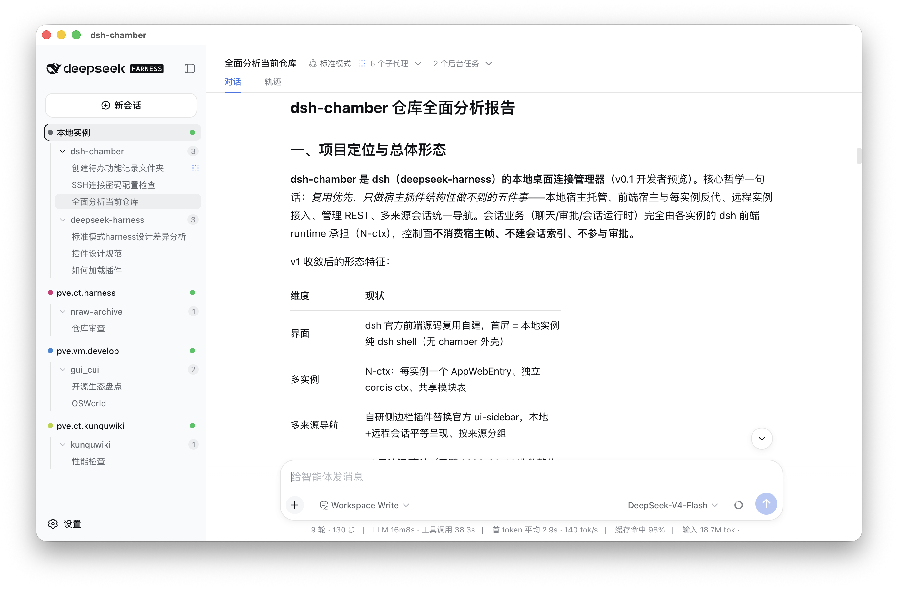

# dsh-chamber

[](../LICENSE)
[]()

**The desktop connection manager for [dsh](https://github.com/deepseek-ai/deepseek-harness) (DeepSeek Harness)**: a native desktop app that brings dsh instances on this machine and on any number of servers into a single window — local works out of the box, remote connects in one step.

**Why dsh-chamber?**

- **Native desktop, works out of the box** — the local dsh instance is hosted automatically (spawn, supervision, health checks) with no command line required; multiple dsh shells run in parallel inside one window (N-ctx), switch at any time
- **dsh runtime version management + hot reload** — every instance's dsh runtime is managed independently: switching versions and updating plugins takes effect immediately, with no reinstall or restart of the desktop app
- **Multi-device connections from the desktop** — one computer manages dsh on this machine and on any number of servers: SSH tunnels are set up automatically and remote systemd services are managed for you; authenticated Gateway access is also available
- **A better sidebar and remote experience** — sessions/workspaces from local and remote sources are listed equally in one native sidebar, grouped by source: collapse, drag-sort, Git worktree topology, desktop notifications for session completion/questioning/approval, and one-click open in Finder/VS Code

## User interface



*Main user interface — a single window with the dsh-native sidebar listing every source's sessions/workspaces, and the pure-dsh shell of the active instance.*

> 中文版: [README.md](../README.md) · Development: [docs/DEVELOPMENT.en-US.md](DEVELOPMENT.en-US.md) · Design entry: [design/01-overview.md](design/01-overview.md) · Progress: [progress/STATUS.md](progress/STATUS.md)

## Quick start

### 1 · Download and install

Grab the installer for your platform from [GitHub Releases](https://github.com/panzeyu2013/dsh-chamber/releases):

- **macOS**: `dsh-chamber-<version>-<arch>.dmg`
- **Windows**: NSIS installer (`.exe`)
- **Linux**: `dsh-chamber-<version>.AppImage` (x64; needs FUSE or
  `APPIMAGE_EXTRACT_AND_RUN=1`; auto-update requires starting the AppImage
  from a writable path — see `docs/design/21-linux-desktop.md`)

### 2 · Open the app

The **local dsh instance is hosted automatically** (web profile auto-spawn/supervision/health), and the first screen is the local instance's full dsh UI.

### 3 · Deploy the server side (before connecting remotely)

To reach a dsh instance on a remote server, deploy one of the following on that server first — the desktop app can only connect after that. Either way works:

#### Option A: one-shot script — Gateway (recommended)

The Gateway hosts a dsh instance on the server and provides a single authenticated access entry. One command starts the interactive wizard (every option explained and validated; `q` quits, `ESC` or `back` goes back):

```bash
curl -fsSL -o install-gateway.sh \
  https://raw.githubusercontent.com/panzeyu2013/dsh-chamber/main/scripts/install-gateway.sh
bash install-gateway.sh
```

The script completes automatically (defaults: loopback-only access, install under `~/.dsh-chamber`, gateway listens on 30801, managed dsh on 30800; all editable):

1. **dsh readiness** — probes for dsh: reuses an existing managed version, asks before taking over an unmanaged one, and installs it if absent
2. **Download + verification** — pulls the package from GitHub Releases and checks the sha256
3. **Install** — local install by default; the gateway owns the dsh version, switchable at runtime via `/chamber/runtime`
4. **Credentials** — double entry with the character count shown, written to a 0600 config file
5. **Service** — systemd unit (system unit under root; non-root defaults to `systemctl --user`; auto-foreground without systemd)
6. **Health check** — polls `/health` until ready

After installation:

- **Daily management**: `install-gateway.sh status|logs|restart|update|uninstall`
- **Public access**: reverse-proxy HTTPS to `127.0.0.1:30801` with Nginx/Caddy, see [deploy/deploy-gateway.md](deploy/deploy-gateway.md)
- **Desktop access**: Settings → Connections, add a Gateway source (HTTP transport + proxy address), optionally configure the shared token / login password

#### Option B: remote dsh instance + systemd

Without a gateway, persist the server's dsh instance directly with **systemd** (system or user unit, running as a non-root user), and the desktop app connects over an SSH tunnel. Full configuration and troubleshooting: [deploy/remote-dsh-instance.md](deploy/remote-dsh-instance.md).

Already running such a direct instance and switching to the Gateway? Existing data does not follow automatically — after installing the gateway, run the one-time migration in [deploy-gateway.md §3 "Migrating from a direct dsh instance to the Gateway"](deploy/deploy-gateway.md) so your sessions/workspaces carry over seamlessly.

### 4 · Add a remote host

In Settings → Connections, select a target (`dsh` / `gateway`) and a transport (`ssh` / `http`) in any of the four combinations: the app sets up the SSH tunnel itself and can manage remote systemd; HTTP(S) is connected directly by the main process (HTTPS by default, with a persistent risk warning for explicit plaintext HTTP).

## Features

- **Local dsh hosting, one click** — works out of the box: the local instance auto-starts with readiness/supervision/reaping, health status, and host logs; the first screen is the local instance's full dsh UI
- **Runtime version management (hot reload)** — manage the dsh runtime per instance from Settings: switching versions and upgrading/rolling back takes effect immediately, plugin updates need no desktop-app restart (local instances and gateways alike)
- **Remote instances over SSH** — add a host in the connections settings and the app sets up an SSH tunnel and manages the remote systemd service; key or password authentication
- **Authenticated Gateway access** — after deploying a gateway on the server, attach it to the desktop as a `gateway` source; shared token / login password configured as needed, HTTPS by default
- **Unified multi-source sidebar navigation** — sessions/workspaces from every source (local + remote instances) are listed equally in the dsh-native sidebar, grouped by source (remote sources carry a colored badge); single click opens a session, double click renames
- **Sidebar collapse / drag / accent colors** — source-level collapse toggles fold the whole source's workspace list; server groups can be drag-sorted (persisted across instances); sources/workspaces carry soft accent color bars
- **Git worktree lifecycle** — a bundled, independent chamber plugin shows per-instance repository topology in the sidebar and closes the worktree → workspace → session create flow; deletion is a retryable Git-first transaction that hard-blocks main/locked/running targets, force-removes a dirty target only after the dialog's explicit "discard uncommitted changes" consent (branches and commits stay untouched), and may also delete the local branch from the dialog
- **Multiple instances in parallel (N-ctx)** — several dsh shells coexist in one window; switch the active instance at any time
- **Open-in registry** — one unified open surface in the session header: reveal directories in Finder/file manager for local sources, and launch VS Code for local (`vscode://file/`) or SSH-transport remote sources (Remote-SSH); supports `dsh-chamber://` deep links
- **Desktop notifications** — native notifications when a session completes or asks/requests approval; clicking opens the session; toggle per the Settings "Notifications" group
- **Desktop updates** — stable and beta use independent configuration and feeds; checks stay silent, Settings shows a low-key "Update" section, download starts only after confirmation, and installation happens on quit
- **Sleep / background persistence** — close behavior is configurable (hide to tray and keep running, or quit with confirmation); launch at login (mac/linux); immediate reconnect on OS wake; keep-awake toggle
- **Chamber settings page** — fixed Settings-shell entries: Connections / General; chamber-global settings stay strictly separate from per-instance config planes
- **Backend version tolerance** — instances whose backend dsh frontend version differs from the chamber shell keep working: extra plugin rows the shell does not cover degrade to absent features (never a whole-boot crash)

## FAQ

- **Why does `pnpm run smoke` print SKIP?** — the smoke test needs a dsh install; when it can't find one it prints SKIP and exits 0. This is normal, not a failure.
- **What does a remote instance need?** — a reachable API-profile dsh target, or a deployed `@dsh-chamber/gateway` target. Either may use an SSH tunnel or an explicitly configured HTTP(S) endpoint. No separate remote web frontend is needed: the reused local UI reaches it through same-origin proxying.
- **How do agent presets / profiles work across instances?** — per-instance authoritative. Each instance's `settings`/`credentials`/`llm`/`agentPreset` config plane lives only on that instance's side (local = this machine, remote = the far server). To edit a remote preset, switch to that source's shell and use its Settings → Agent presets page.
- **Where does the frontend come from?** — the dsh official frontend, source-reused and self-built; every instance keeps its native UI.

## Documentation

| Document | Purpose |
|---|---|
| [docs/DEVELOPMENT.en-US.md](DEVELOPMENT.en-US.md) | Development: architecture/setup/build/package/CI/release/repo layout |
| [deploy/deploy-gateway.md](deploy/deploy-gateway.md) | Server-side Gateway deployment, full guide |
| [deploy/remote-dsh-instance.md](deploy/remote-dsh-instance.md) | Remote dsh instance persistence with systemd (full guide) |
| [CONTRIBUTING.en-US.md](CONTRIBUTING.en-US.md) | Contribution guide (testing/commits/PR contract) |
| [AGENTS.md](../AGENTS.md) | Development constraints (always-on repository rules) |
| [CHANGELOG.en-US.md](CHANGELOG.en-US.md) | Version history |
| [design/01-overview.md](design/01-overview.md) | Design entry point: consolidation principles, scope, removals |
| [progress/STATUS.md](progress/STATUS.md) | Completion status, remaining deviations & validation record |
| [README.md](../README.md) | 中文 README |

## Related projects

- [deepseek-harness (dsh)](https://github.com/deepseek-ai/deepseek-harness) — the managed host
- [OpenChamber](https://github.com/openchamber/openchamber) — the multi-instance session model that inspired dsh-chamber's N-ctx design and its name; thanks for the inspiration!

## Contributing

See [CONTRIBUTING.en-US.md](CONTRIBUTING.en-US.md). Development constraints live in [AGENTS.md](../AGENTS.md); environment setup and builds are in [docs/DEVELOPMENT.en-US.md](DEVELOPMENT.en-US.md).

## License

MIT — see [LICENSE](../LICENSE).
