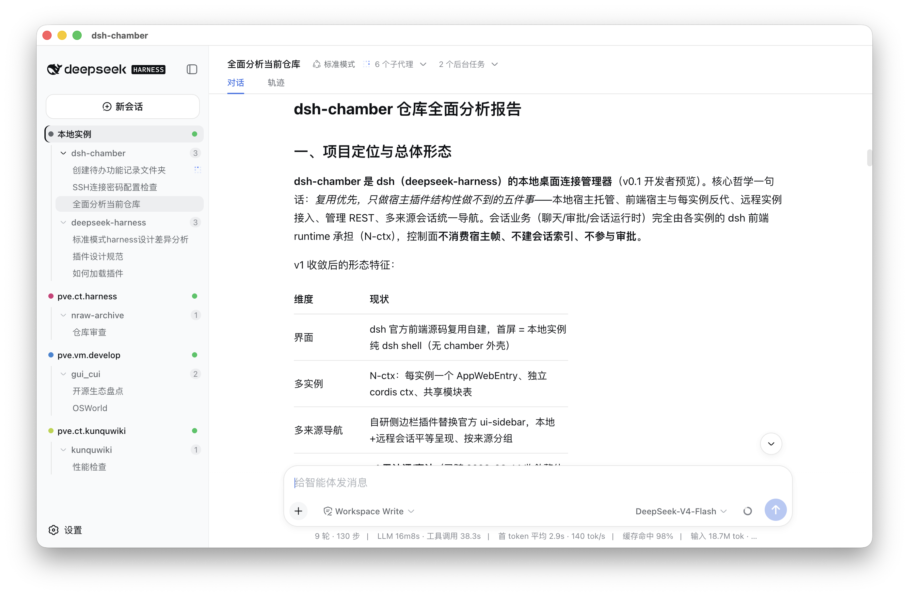

# dsh-chamber

[](../LICENSE)
[]()
[](https://github.com/panzeyu2013/dsh-chamber/releases)
[](https://github.com/panzeyu2013/dsh-chamber/releases)

The desktop connection manager for [dsh](https://github.com/deepseek-ai/deepseek-harness) (DeepSeek Harness): one native window for dsh instances here and on any number of servers — local out of the box, remote over SSH tunnels or an authenticated Gateway, every source sharing the same dsh-native sidebar and official UI.

The macOS build uses a **Swift/AppKit native shell**: window, menus, status item, notifications, Dock badge, deep links, file dialogs, hide/restore and Sparkle in-app updates are implemented in Swift; the business runs in a packaged Node sidecar; the page 100% reuses the dsh official frontend — not a browser wrapper.

## User interface



*Main user interface — one window with the dsh-native sidebar listing each source's sessions/workspaces and the active instance's dsh shell.*

> 中文版: [README.md](../README.md) · Development: [DEVELOPMENT.en-US.md](DEVELOPMENT.en-US.md) · Design: [01-overview.md](design/01-overview.md) · Progress: [STATUS.md](progress/STATUS.md)

## Why dsh-chamber

- **Remote is a first-class source** — the local instance is just the first source: remote servers attach over SSH tunnels (the app builds the tunnel and manages remote systemd), and public/team setups attach through an authenticated Gateway; all of them sit as equals in the same dsh-native sidebar.
- **The official frontend, not a second UI** — the UI is built from the dsh official frontend sources, so every instance keeps its native look and full capability; plugin rows the shell does not cover degrade to absent features and never crash the whole boot.
- **Connection management is the only job** — the control plane only hosts, proxies and serves statics: desktop is loopback-only, the public Gateway is authenticated by default; credentials pass through write-only form inputs and never enter the renderer or logs, and are kept on this machine in 0600 files (Gateway credentials are encrypted with the OS keychain when available, with a plaintext fallback) — never shown back in the UI.

|Capability|dsh-chamber|Official Desktop|SSH/tunnel community clients|
|---|---|---|---|
|Automatic local dsh hosting|✅|✅|✅|
|Remote instance over SSH (tunnel + remote systemd)|✅|❌|Mostly sync or ops panels, not attach-to-remote-instance|
|Authenticated Gateway (server-side public shape)|✅|❌|❌|
|Multiple instances in one window (N-ctx) + unified sidebar|✅|❌|Some|
|Official frontend source reuse|✅|✅|Some package the Web UI|

> The official Desktop covers the local-only case; a connection manager is for **one window over your machine plus several servers**, or for putting dsh on the public internet behind authentication.

## Quick start

### 1 · Download and install

The macOS installer comes from [GitHub Releases](https://github.com/panzeyu2013/dsh-chamber/releases):

- macOS (Apple Silicon): `dsh-chamber-<version>-macos-arm64.dmg`

Currently 0.4.x: stable and beta channels are independent; see [CHANGELOG.en-US.md](CHANGELOG.en-US.md) for changes.

### 2 · Open the app

The local dsh instance is hosted automatically (web profile auto-spawn/supervision/health, no command line); the first screen is its full dsh UI.

### 3 · Deploy the server side (before connecting remotely)

To reach a dsh instance on a remote server, deploy it there first; the app can only connect after that. Either way works:

#### Option A: one-shot script — Gateway (recommended)

The Gateway hosts a dsh instance behind one authenticated entry point. One command starts the interactive wizard (every option explained and validated; `q` quits, `ESC` or `back` goes back):

```bash
curl -fsSL -o install-gateway.sh \
  https://raw.githubusercontent.com/panzeyu2013/dsh-chamber/main/scripts/install-gateway.sh
bash install-gateway.sh
```

The script completes automatically (defaults: loopback-only, `~/.dsh-chamber` install, gateway on 30801, managed dsh on 30800; all editable):

1. dsh readiness — probes for dsh: reuses a managed version, asks before taking over an unmanaged one, installs if absent
2. Download + verification — pulls the package from GitHub Releases and checks the sha256
3. Install — local by default; the gateway owns the dsh version, switchable at runtime via `/chamber/runtime`
4. Credentials — double entry with the character count shown, written to a 0600 config file
5. Service — systemd unit (system unit under root; non-root defaults to `systemctl --user`; auto-foreground without systemd)
6. Health check — polls `/health` until ready

After installation:

- Daily management: `install-gateway.sh status|logs|restart|update|uninstall`
- Public access: reverse-proxy HTTPS to `127.0.0.1:30801` with Nginx/Caddy — see [deploy/deploy-gateway.md](deploy/deploy-gateway.md)
- Desktop access: Settings → Connections, add a Gateway source (HTTP transport + proxy address); shared token / login password as needed

#### Option B: remote dsh instance + systemd

Without a gateway, persist the server's dsh instance with systemd (system or user unit, non-root) and connect over SSH; configuration and troubleshooting: [deploy/remote-dsh-instance.md](deploy/remote-dsh-instance.md).

Already on a direct instance and switching to the Gateway? Existing data does not follow; after installing the gateway, run the one-time migration in [deploy-gateway.md §3 "Migrating from a direct dsh instance to the Gateway"](deploy/deploy-gateway.md).

### 4 · Add a remote host

In Settings → Connections, pick a target (`dsh` / `gateway`) and a transport (`ssh` / `http`) — all four combinations: the app sets up SSH tunnels and can manage remote systemd; HTTP(S) connects from the main process (HTTPS by default; plaintext HTTP shows a permanent risk warning).

## Features

- macOS Swift native shell — AppKit window + WKWebView; menus/status item/notifications/badge/deep links/file dialogs/hide-restore and Sparkle in-app updates are native; the shell carries no business logic and the page 100% reuses the official frontend
- Local dsh hosting, one click — the local instance auto-starts with readiness, supervision/reaping, health status and host logs; the first screen is its full dsh UI
- Runtime version management (hot reload) — switch/upgrade/roll back the dsh runtime per instance in Settings, effective immediately; plugin updates need no desktop-app restart (local and gateway alike)
- Remote instances over SSH — add a host and the app sets up an SSH tunnel and manages the remote systemd service; key or password auth
- Authenticated Gateway access — attach a deployed gateway as a `gateway` source; shared token / login password as needed, HTTPS by default
- Unified multi-source sidebar navigation — sessions/workspaces from every source (local + remote) listed equally in the dsh-native sidebar, grouped by source (remote ones carry a badge); single click opens, double click renames
- Sidebar collapse / drag / accent colors — source-level collapse toggles fold that source's workspace list; server groups drag-sort (persisted across instances); sources/workspaces carry accent bars
- Git worktree lifecycle — per-instance repository topology in the sidebar plus a closed worktree → workspace → session create flow; deletion is a retryable Git-first transaction: main/locked/running targets are hard-blocked, a dirty target is force-removed only after the dialog's explicit "discard uncommitted changes" consent (branches and commits stay), and the local branch can optionally go too
- Multiple instances in parallel (N-ctx) — several dsh shells in one window; switch the active instance any time
- Open-in registry — one open surface in the session header: reveal directories in Finder/file manager for local sources; launch VS Code for local (`vscode://file/`) or SSH remote (Remote-SSH) sources; supports `dsh-chamber://` deep links
- Desktop notifications — native notifications for session completion/question/approval, clicking opens the session; toggle in Settings "Notifications"
- Desktop updates — stable and beta use separate configs and feeds; silent checks, an "Update" section in Settings, download after confirmation, install on quit (low-noise, no dialogs)
- Sleep / background persistence — closing can hide to tray and keep running (or quit with confirmation); launch at login (macOS); reconnect on OS wake; keep-awake toggle
- Chamber settings page — fixed Settings-shell entries: Connections / General; chamber-global and per-instance settings strictly separate
- Backend version tolerance — instances whose backend dsh frontend version differs from the chamber shell keep working: extra plugin rows the shell does not cover degrade to absent features (never a whole-boot crash)

## FAQ

- **Why does `pnpm run smoke` print SKIP?** — the smoke test needs a dsh install; without one it prints SKIP and exits 0 — normal, not a failure.
- **Where do my credentials go?** — two places, both on this machine: (1) the instance's own config plane (local = this machine's dsh home, remote = the far dsh home, managed by that instance's dsh); (2) the connection credentials saved by the desktop shell under `<userData>` (Gateway credentials are encrypted with the OS keychain when available, otherwise a 0600 plaintext fallback; SSH passwords use a 0600 plaintext fallback by explicit user decision), used to reconnect without re-entering. Credentials are write-only form inputs, are never shown back in the UI, and never enter the renderer or logs; the Gateway installer writes its config file with 0600 permissions.
- **How is this different from the official Desktop?** — the official Desktop covers the local-only case; dsh-chamber differs on remote and multi-machine use: attaching remote instances over SSH, an authenticated Gateway, and local + remote as equal sources in one window. For local-only use both work out of the box; pick by whether you need remote.
- **What does a remote instance need?** — a reachable API-profile dsh target, or a deployed `@dsh-chamber/gateway`. Either can use an SSH tunnel or explicit HTTP(S); no remote web frontend is needed — the reused local UI reaches it via same-origin proxying.
- **How do agent presets / profiles work across instances?** — per-instance authoritative: each instance's `settings`/`credentials`/`llm`/`agentPreset` config plane lives only on that side (local = this machine, remote = the far server). To edit a remote preset, switch to that source's shell Settings → Agent presets.
- **Where does the frontend come from?** — the dsh official frontend, source-reused and self-built; every instance keeps its native UI.
- **macOS shows the screen-recording prompt but dsh-chamber never appears in Settings (or the switch is on yet capture still fails)?** — In System Settings → Privacy & Security → Screen & System Audio Recording, select any old dsh-chamber entry, remove it with "−", then re-add `/Applications/dsh-chamber.app` with "+", turn it on, and finally quit (⌘Q) and reopen dsh-chamber (machines upgraded from an older build or a different bundle id must do this remove-then-re-add once; `tccutil reset` can only clear records, never create one).

## Documentation

|Document|Purpose|
|---|---|
|[docs/DEVELOPMENT.en-US.md](DEVELOPMENT.en-US.md)|Development: architecture/setup/build/package/CI/release/repo layout|
|[deploy/deploy-gateway.md](deploy/deploy-gateway.md)|Server-side Gateway deployment guide|
|[deploy/remote-dsh-instance.md](deploy/remote-dsh-instance.md)|Remote dsh instance persistence with systemd|
|[CONTRIBUTING.en-US.md](CONTRIBUTING.en-US.md)|Contribution guide (testing/commits/PR contract)|
|[AGENTS.md](../AGENTS.md)|Development constraints (always-on repo rules)|
|[CHANGELOG.en-US.md](CHANGELOG.en-US.md)|Version history|
|[design/01-overview.md](design/01-overview.md)|Design entry: consolidation principles, scope, removals|
|[progress/STATUS.md](progress/STATUS.md)|Status, remaining deviations & validation record|
|[README.md](../README.md)|中文README|

## Related projects

- [deepseek-harness (dsh)](https://github.com/deepseek-ai/deepseek-harness) — the managed host
- [OpenChamber](https://github.com/openchamber/openchamber) — the multi-instance session model behind dsh-chamber's N-ctx design and name; thanks for the inspiration!

## Community

- Official DeepSeek Harness Discussions: [dsh-chamber introduction thread](https://github.com/deepseek-ai/deepseek-harness/discussions/8724)

## Contributing

See [CONTRIBUTING.en-US.md](CONTRIBUTING.en-US.md). Constraints: [AGENTS.md](../AGENTS.md); setup and builds: [docs/DEVELOPMENT.en-US.md](DEVELOPMENT.en-US.md).

## License

MIT — see [LICENSE](../LICENSE).
